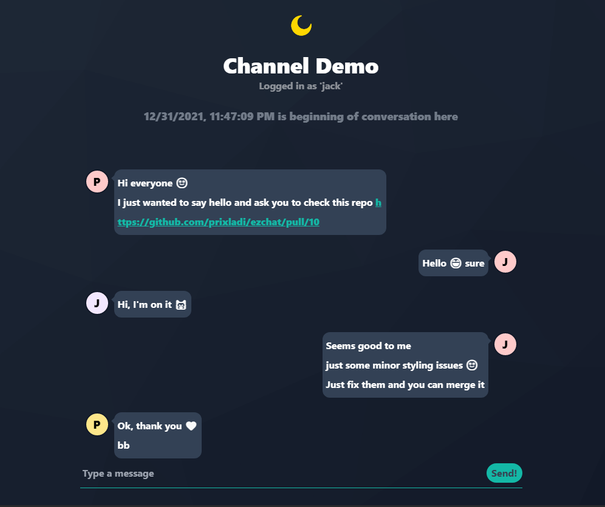
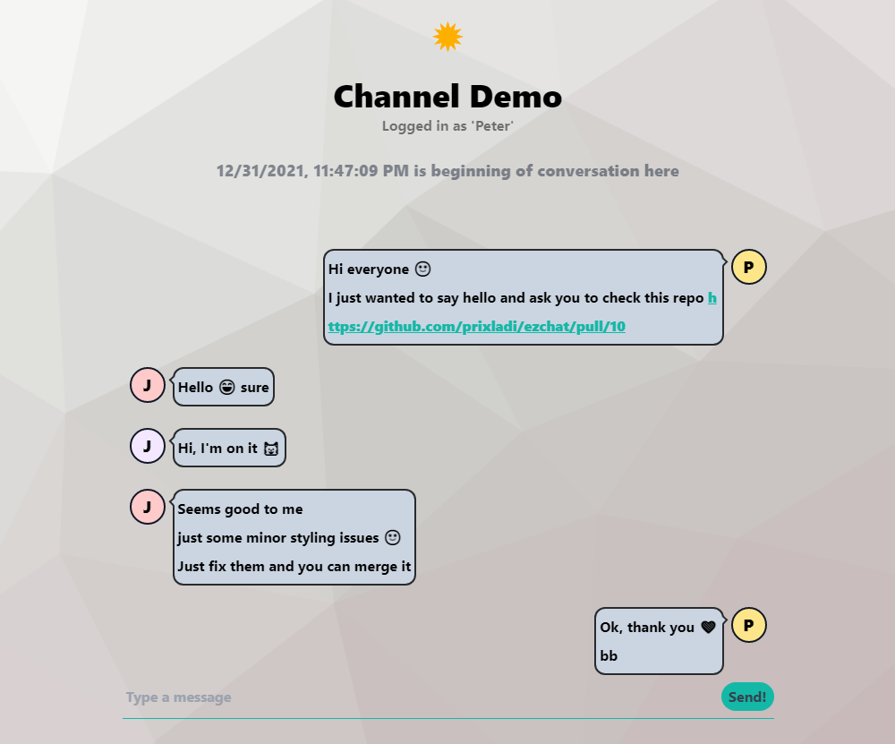

# Ezchat

Dead simple chat application. No login, just pick channel choose username and chat. Supports dark/light theme.

[Run application](#run-application)  
[Images](#images)  
[TODO](#todo)  

## Run Application 

Run whole application using docker:

```bash
docker-compose up -d
```

Or you can start each part of the application separately. Instruction can be find relevant folders (*/api, /web*).

## Images 




## TODO

1) https://github.com/vercel/next.js/issues/32513 (500 on image load)
2) Optional twitter/google/fb login
3) Show online chatters
4) Channel moderation
5) Change username
6) Change channel name (?)
